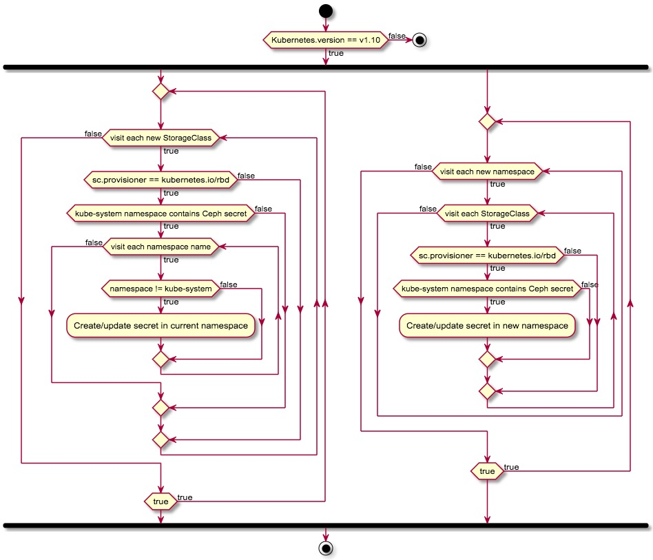

## 简介

由于 Kubernetes v1.10 版本内置的 Ceph RBD 将存储卷挂载至 Pod 时，要求当前 namespace 有 storageclass 内指定的 secret，给用户带来了不便，所以要在 Kubesphere 的后端内开发根据 RBD storageclass user secret 字段自动在各 namespace 自动创建 secret 的 controller。 在 Kubernetes v1.11 无需此 controller。

## 作用范围

- kubernetes v1.10
- Kubernetes 内置的 RBD storageclass
- secret 须在 kube-system namespace 里先创建一份

|用户|控制器行为|
|:---:|:---:|
|创建 sc 和 secret|读取 kube-system 的 secret，在各 ns 创建或更新 secret|
|创建 sc，无 secret|无|
|删除 sc|无|
|删除 kube-system 的 secret|无|
|更新 secret 内容|无|

## 流程图

